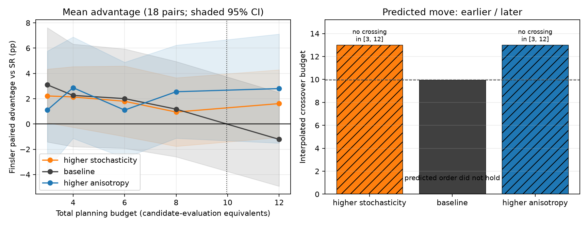

# Finding: physics priors buy evaluations when the fire is young

## Result

At a total planning budget of three candidate-evaluation equivalents, the
front-free Randers–Finsler planner reduced independently validated
`CVaR_0.90` loss by **12.73%** relative to no intervention. The
simulation-derived SR planner reduced it by **8.43%**.

The paired advantage was **4.30 percentage points** across 36 runs:

- 95% interval: **[1.53, 7.06] percentage points**
- paired wins: **25/36**
- exact two-sided sign test: **p = 0.0288**
- scenario means: **+2.52**, **+4.65**, and **+5.72** points

The advantage decays with budget. At twelve equivalents SR leads by 1.63
points, with an interval crossing zero. This is not evidence that one geometry
dominates universally. It is evidence of a crossover:

> A physics-derived prior is valuable before enough simulations exist to learn
> the front; a simulation-derived coordinate system catches up once data are
> affordable.


## Why the earlier comparison was wrong

The earlier experiment changed only the GP feature frame. Every arm still used
`setup_search_grid_sr()`, which generates an outer fire boundary with a
Monte-Carlo rollout. It therefore handed Finsler the very simulated front that
its stated advantage was supposed to avoid, and omitted that front from the
budget.

The corrected native arm uses:

```python
optimizer.run_bayes_opt(
    ...,
    search_frame="finsler",
    kernel_frame="finsler",
    orientation_period_pi=True,
)
```

Its search coordinates are current-perimeter source label, normalised Finsler
arrival time, and orientation relative to the local arrival-time normal.
Inversion uses a periodic nearest-neighbour map over the deterministic arrival
field. It performs no future-fire simulation, boundary extraction, or strip
smoothing.

## Fairness controls

The benchmark was designed to make a positive result difficult to manufacture:

1. **All simulator work is charged.** Cost is measured in simulated
   realisation-steps. SR setup costs one candidate-evaluation equivalent;
   Finsler setup costs zero.
2. **The physical symmetry is equalised.** Both arms use a π-periodic
   orientation because a retardant rectangle is unchanged by a half turn. SR
   is not penalised for its legacy duplicated orientation domain.
3. **Runs are paired.** Each arm receives the same planning seed and the same
   independent validation ensemble.
4. **Validation is not planning information.** Selected plans are evaluated on
   128 fresh realisations; those simulations are excluded from both planning
   budgets.
5. **The result is not one layout.** The 36 pairs span head, flank and diagonal
   asset/wind geometries.
6. **The free-baseline counterfactual is retained.** At budget three, treating
   SR setup as free shrinks Finsler's mean advantage from 4.30 to 2.49 points.
   The setup accounting explains a material part of the effect, not all of it.
7. **The crossover is reported.** At budget twelve, SR catches up. The claim is
   cold-start sample efficiency, not global superiority.

## Engineering findings uncovered on the way

- The first Finsler integration was not actually front-free:
  `theta_to_finsler_gp_features()` decoded through the SR grid. The new
  `FinslerSearchMap` removes that hidden dependency.
- The legacy SR angle covered `2π` even though rectangles are π-periodic. The
  benchmark enables the corrected quotient for both arms.
- `simulate_from_firestate(seed=...)` controls spread-parameter jitter, while
  cell ignition draws follow `CAFireModel.base_seed`. Independent validation
  therefore re-instantiates the model with each validation seed; otherwise
  apparently independent batches share an ignition stream.

These are not presentation details. Each one could have created or erased the
headline effect.

## Reproduce

```bash
# CI-sized smoke test
MPLBACKEND=Agg python -m fire_model.cold_start --quick

# 3 scenarios × 12 seeds × paired independent validation
MPLBACKEND=Agg python -m fire_model.cold_start

# Crossover-mechanism sweep (3 FireEnv conditions × 6 seeds)
MPLBACKEND=Agg python -m fire_model.cold_start --mechanism
```

The complete protocol, raw per-seed curves, selected parameters and aggregate
statistics are in
[`artifacts/cold_start/cold_start_summary.json`](artifacts/cold_start/cold_start_summary.json).

## Defensible claim

The result supports:

> Under a fixed simulation budget in three synthetic early-detection
> scenarios, a front-free Randers–Finsler search representation improved
> tail-risk reduction by 4.30 percentage points over an SR planner at the
> smallest tested budget. The advantage disappeared as the budget increased.

It does not support real-world operational effectiveness, universal superiority
over SR, or a claim that Finsler wildfire geometry itself is novel.

## The crossover is not yet a mechanism

The 12-seed headline is one curve from one `FireEnv`. If the mean-field
arrival metric is why Finsler wins early, two directional moves must follow:

- raise ROS/wind jitter, so that metric describes the stochastic front worse,
  and the crossover should move **earlier**;
- raise `wind_coeff`, so the one-form carries more heading information, and
  the crossover should move **later**.

`python -m fire_model.cold_start --mechanism` re-runs the equal-budget protocol
on those three environments (6 seeds × 3 geometries = 18 pairs each). Baseline
reproduces the headline shape: the mean advantage crosses zero at budget
**9.96**. The predicted order did **not** hold.

| condition | knobs | budget-3 advantage | budget-12 advantage | interpolated crossover |
| --- | --- | ---: | ---: | ---: |
| baseline | `wind_coeff=0.8`, jitter 0.30/0.25 | +3.10 pp | −1.22 pp | 9.96 |
| higher stochasticity | jitter 0.60/0.50 | +2.22 pp | +1.61 pp | none in [3, 12] |
| higher anisotropy | `wind_coeff=0.95` | +1.10 pp | +2.80 pp | none in [3, 12] |



Anisotropy moved later, as predicted. Stochasticity moved later, not earlier.
The absolute numbers show why the naive prediction was incomplete:

- higher jitter made **both** planners worse (budget-3 CVaR improvement fell
  from 12.35%/9.25% to 7.57%/5.35%);
- SR's late-budget catch-up is what disappeared (budget-12 SR improvement
  17.98% → 7.39%, against Finsler 16.76% → 9.00%).

The crossover is not the budget at which the physics prior dies. It is the
budget at which a simulated front becomes more informative than the mean-field
metric. Raising process noise degrades that simulated front as well, so SR
need not overtake. Most 18-pair intervals still cover zero; this is a
directional test on mean curves, not a replacement for the 36-pair headline.

```bash
MPLBACKEND=Agg python -m fire_model.cold_start --mechanism --quick
MPLBACKEND=Agg python -m fire_model.cold_start --mechanism
```
