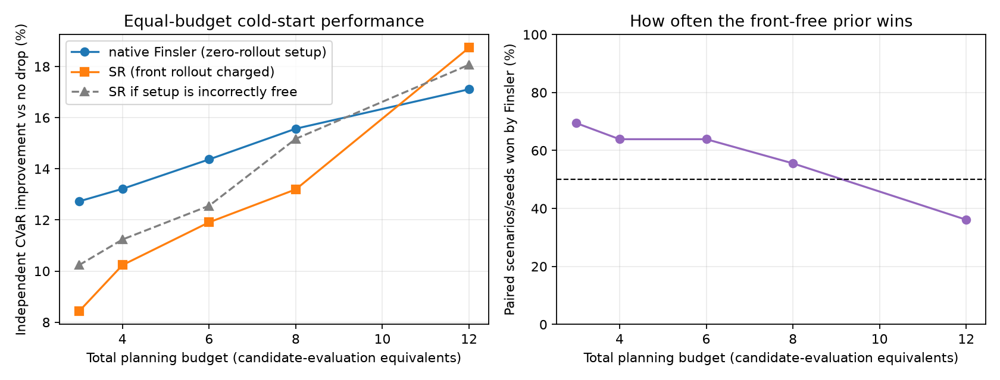

# Wildfire Drone Swarm BO

**Under the smallest equal simulation budget, a front-free Randers–Finsler
planner improved worst-tail loss reduction by 4.30 percentage points over a
simulation-derived fire-front planner across 36 paired runs. The advantage
disappeared as the budget increased.**

The planner combines a stochastic cellular-automata fire simulator,
CVaR-targeting Bayesian optimisation, fire-front-relative interventions and
physics-derived arrival-time geometry. The original reproducible MFBO smoke test
still reduces `CVaR_0.90` asset loss by 5.7% against no intervention. These are
software results on synthetic scenarios, not claims of operational wildfire
effectiveness.



---

## What this repo does

1. **Simulate** wildfire spread on a grid with fuel, wind, slope, and retardant decay.
2. **Parameterise** candidate drops in Cartesian, simulated-front SR, or front-free Finsler arrival-time coordinates.
3. **Optimise tail risk** using empirical `CVaR_0.90` of per-realisation asset loss rather than averaging the ensemble before optimisation.
4. **Screen cheaply** with short-horizon, low-simulation rollouts before higher-fidelity evaluations in an autoregressive co-kriging BO loop.
5. **Evaluate** on synthetic stress-test scenarios and a Victoria-style semi-realistic environment.

---

## Features

| Area | Details |
|------|---------|
| Fire model | Grid CA with wind, fuel, value maps, time-varying ROS, retardant half-life |
| Drop geometry | Oriented rectangular drops with optional “avoid burning cells” |
| Coordinates | Cartesian, simulated-front SR, and front-free Finsler arrival-time plans |
| GP kernel | Anisotropic Matérn over positions/orientations rotated into the observed mean-wind frame |
| Fire-front geometry | Randers–Finsler metric fitted to the CA's own spread law; arrival time as a Finsler distance |
| Optimisation | CVaR objective, expected improvement, heuristic warm-starts, multi-fidelity co-kriging |
| Baselines | Ring / boundary / head–flank / value-blocking heuristics |
| Scenarios | Fuel jumps, wind corridors, asset clusters, realistic Victorian layout |

---

## Setup

Requires Python 3.11+.

```bash
git clone https://github.com/vivimartini/wildfire-drone-swarm-bo.git
cd wildfire-drone-swarm-bo

python -m venv .venv
source .venv/bin/activate          # Windows: .venv\Scripts\activate

pip install -e .
```

The editable install puts the `fire_model` package on your path so notebooks under `notebooks/` import cleanly. Each notebook also has a short bootstrap cell that locates the repo root if you open it without installing.

---

## Reproduce the headline result

```bash
bash run_all.sh
```

This creates a clean virtual environment, installs pinned dependencies, runs the
tests and reproduces `artifacts/reproduction/summary.json` plus the figure above.
The checked-in quick-run result is:

```text
No-drop CVaR_0.90:       18.5670
Selected-plan CVaR_0.90: 17.5000
Relative reduction:       5.75%
```

See [REPRODUCIBILITY.md](REPRODUCIBILITY.md) for the exact fidelity budgets,
seeds, independent validation design and full-sized command. See
[DECISIONS.md](DECISIONS.md) for modelling choices and the evidence boundary.

---

## Repository layout

```
fire_model/                      Core simulation + optimisation library
  ca.py                          Cellular automata fire model (FireEnv, FireState)
  boundary.py                    Fire-front extraction and between-boundary masks
  harmonic.py                    Harmonic strip maps → (s, r) parameterisation
  bo.py                          Bayesian optimisation in (x, y, φ)
  bo_sr.py                       CVaR, wind-aligned SR BO and multi-fidelity BO
  finsler.py                     Randers metric, Finsler arrival time, kernel warp
  finsler_validation.py          Validates the geometry against the simulator
  cold_start.py                  Equal-budget front-free vs SR benchmark
  demo.py                        Deterministic command-line reproduction

tests/                           CA, CVaR, wind-frame and Finsler regression tests
artifacts/reproduction/          Checked-in output from the quick reproduction
artifacts/finsler/               Checked-in Finsler geometry validation
artifacts/cold_start/             Checked-in cold-start finding and raw paired data

notebooks/
  experiments/                   End-to-end BO / MFBO and final experiment runs
  scenarios/                     Stress-test + realistic environment notebooks
  heuristics/                    Heuristic baselines and comparisons
  parameterization/              SR mapping checks and figure notebooks
  archive/                       Older exploratory work

figures/
  report/                        Figures used in the written report
```

---

## Notebook guide

| Goal | Notebook |
|------|----------|
| Realistic end-to-end BO | [`notebooks/experiments/end_to_end_realistic_BO.ipynb`](notebooks/experiments/end_to_end_realistic_BO.ipynb) |
| Small-grid SR BO walkthrough | [`notebooks/experiments/end_to_end_polar_BO_small.ipynb`](notebooks/experiments/end_to_end_polar_BO_small.ipynb) |
| Final experiments | [`notebooks/experiments/FINAL_EXP.ipynb`](notebooks/experiments/FINAL_EXP.ipynb) |
| Iterative / MFBO finals | [`notebooks/experiments/FINAL_EXP_ITERATIVE_MFBO.ipynb`](notebooks/experiments/FINAL_EXP_ITERATIVE_MFBO.ipynb) |
| Arrival delay vs swarm size | [`notebooks/experiments/experiment_early_detection_vs_drones.ipynb`](notebooks/experiments/experiment_early_detection_vs_drones.ipynb) |
| Scenario suite + report figures | [`notebooks/scenarios/scenarios_final_all_BO_report.ipynb`](notebooks/scenarios/scenarios_final_all_BO_report.ipynb) |
| Heuristic baselines | [`notebooks/heuristics/showcasing_heuristics.ipynb`](notebooks/heuristics/showcasing_heuristics.ipynb) |
| SR coordinate system | [`notebooks/parameterization/fire_front_sr_parameterization.ipynb`](notebooks/parameterization/fire_front_sr_parameterization.ipynb) |

---

## Method sketch

**Simulation.** Each cell burns for a finite time; spread rate depends on fuel, wind, and optional slope. Retardant deposited by drones decays over time and slows (or blocks) ignition.

**Search space.** Drops are rectangles with position and orientation. In the SR formulation, candidates live in the strip between the fire front at detection and a predicted later front, which keeps the search focused on actionable ground.

**Risk objective.** Every candidate retains its unaggregated Monte-Carlo loss
vector. BO minimises the mean of the worst 10% of losses (`CVaR_0.90`), so the
tail—not expected damage—drives plan selection.

**Wind-aligned surrogate.** Cartesian drop positions are rotated into along-wind
and cross-wind coordinates. Drop orientation is represented relative to the same
wind direction, and the Matérn kernel learns separate lengthscales on these axes.

**Finsler surrogate frame.** The wind-aligned frame above is a hand-built
approximation of a geometry the simulator already implies. `kernel_frame="finsler"`
derives it instead — see [Fire-front geometry](#fire-front-geometry-randersfinsler).

**Multi-fidelity optimisation.** An autoregressive low/high-fidelity surrogate
uses 300-second, 8-realisation rollouts to screen candidates before 600-second,
24-realisation evaluations in the reproducible run.

**Baselines.** Hand-designed heuristics (e.g. protect the head/flank, ring the fire, sit on high-value cells) provide interpretable comparisons.

---

## Fire-front geometry (Randers–Finsler)

Fire spread under wind is the canonical worked example of a **Randers metric** —
a Riemannian metric plus a one-form, where the Riemannian part is the no-wind
spread rate and the one-form is the wind drift. Richards' elliptical growth
model, the operational standard in fire modelling, is a Randers metric in
disguise, and fire arrival time is the Finslerian distance from the ignition set.

`fire_model/finsler.py` uses that directly instead of approximating it:

```python
from fire_model.finsler import randers_from_env, FinslerWarp

field = randers_from_env(env)                    # fit the metric to the CA's spread law
warp  = FinslerWarp.from_firestate(env, state)   # arrival time -> kernel-safe features
```

The fully front-free planner must select both the Finsler search map and kernel:

```python
optimizer.run_bayes_opt(
    ...,
    search_frame="finsler",      # no Monte-Carlo future boundary
    kernel_frame="finsler",
    orientation_period_pi=True,  # quotient the rectangle's half-turn symmetry
)
```

Setting only `kernel_frame="finsler"` retains the SR search map and therefore
still pays for a simulated future front; that is useful as a feature ablation,
but it is not the front-free method.

**The metric is derived, not chosen.** The CA's directional rate law is
projected onto the Randers family, so the surrogate's anisotropy follows from
the spread parameters rather than from a hand-built frame. Containment lines are
then placed against where the front will be, not against grid `x` and `y`.

The projection targets the *indicatrix* radial function

```
σ(u) = W·u + √(s² − |W|² + (W·u)²)          # circle of radius s centred on the drift W
```

and **not** `s + W·u`. A Randers metric is `F(v) = √(a(v,v)) + b·v`, so its
radial function is `1/(√(a(u,u)) + b·u)` — the *reciprocal* of a linear form.
The two agree only to first order in `|W|/s`; at `|W|/s = 0.8` the linear
version overstates the flank rate by 67%. Squaring the target rearranges to
`σ² = 2σ(W·u) + q` with `q = s² − |W|²`, which is linear in `(W, q)`, so the fit
is a closed-form 3×3 least-squares solve per cell and strong convexity is just
`q > 0`.

With `FireEnv.wind_response="elliptical"` — Richards' law, opt-in, default
unchanged — and sub-critical wind (`wind_coeff·|w| < 1`), the fit residual is
**9e−15**: the CA's spread law *is* a Randers indicatrix, so the metric is a
restatement of the simulator rather than an approximation of it.

**The catch, and the fix.** Finsler distance is not symmetric — travelling
upwind is slower than downwind, so `d_F(x, y) ≠ d_F(y, x)`, by up to 160% here.
It therefore cannot be substituted for the distance in a Matérn kernel: a
covariance function must be symmetric and positive definite, and a directed
distance is neither. Symmetrising it (mean or min of the two directions)
restores symmetry, still guarantees nothing about positive definiteness, and
discards precisely the asymmetry that made the geometry worth having.

So the geometry is **warped rather than substituted**. Each drop is mapped
through a fixed, deterministic function of the arrival-time field, and an
ordinary stationary Matérn acts in that warped space; positive definiteness is
then free. The asymmetry survives because the forward and reverse arrival times
enter as two separate coordinates instead of being averaged into one:

| Feature | Meaning |
|---------|---------|
| `t_forward` | `d_F(front, x)` — when the fire reaches this drop |
| `t_reverse` | `d_F(x, front)` — the asymmetry channel, discarded by symmetrising |
| `cos s`, `sin s` | which part of the perimeter the fire arrives from (periodic) |
| `cos 2δ`, `sin 2δ` | drop angle to the local front normal (π-periodic: a rectangle has no head) |

**Validation.** `python -m fire_model.finsler_validation` checks the geometry
against the simulator rather than assuming it, writing
[`artifacts/finsler/`](artifacts/finsler/):


- Geodesic arrival times track simulated first-ignition times with Spearman
  `ρ = 0.91`, against `ρ = 0.57` for an isotropic ablation that keeps the same
  mean speed and zeroes the drift. The gap opens up with anisotropy and closes
  as `‖b‖_a → 0`, as it must: at `‖b‖_a = 0.2` the two are indistinguishable
  (`0.98` vs `0.99`).
- On the stricter test of a single global calibration constant the Randers
  metric also wins (`R² = 0.28` against `0.13`), but both are low in absolute
  terms and the constant is `≈ 0.27`, not 1. The stochastic percolation front
  outruns the mean-field rate the metric describes, because the front advances
  by the earliest of many competing ignition attempts, and that speedup depends
  on the local hazard. Ordering is what a monotone warp coordinate needs;
  calibration is the stricter test, and it is reported rather than hidden.
- Under the default clipped spread law the isotropic metric beats the Randers
  one at every wind strength tested — that law is not an ellipse, and the fit
  says so (residual 2.7% → 11.4%). The geometry is faithful only where the
  simulator's own law is elliptical and the wind is sub-critical.
- Substituting the directed distance into a Matérn gives a non-symmetric matrix.
  Min-symmetrisation gives a minimum eigenvalue of **−0.25**; mean-symmetrisation
  happens to stay PSD on this particular point set, which is the point — nothing
  guarantees it either way. The warp's Gram matrix is positive semi-definite by
  construction.

**Unpriced feature-only comparison.** Five paired BO seeds per frame, every
selected plan re-scored on 128 independent realisations (`--frames`, lower is
better). All three arms below still use the SR search map, so its forecast-front
cost is omitted:

| Frame | `CVaR₀.₉₀`, elliptical | `CVaR₀.₉₀`, clipped |
|-------|-----------------------|---------------------|
| no drop | 6.70 | 10.39 |
| `wind` (default) | **4.72 ± 0.43** | **8.60 ± 0.41** |
| `sr` | 4.77 ± 0.12 | **8.06 ± 0.38** |
| `finsler` | 4.97 ± 0.45 | 8.66 ± 0.63 |

**This does not show the Finsler frame optimising better.** It is level with the
wind-aligned default (paired wins 2/5 and 3/5) and behind `sr` under the clipped
law. At five seeds, with per-seed spreads of this size, none of these gaps is
established. No optimisation gain is claimed, and the frame is not the default.

A plausible reason `sr` holds up: its coordinates are built from *simulated*
fire boundaries, so they already encode the stochastic front's real shape,
including the percolation speedup the mean-field metric misses. What the Finsler
frame offers instead is that it is derived from the spread parameters rather
than requiring a Monte-Carlo front to exist first, that it needs no boundary
extraction or strip smoothing, and that it carries the upwind/downwind asymmetry
explicitly. See [DECISIONS.md](DECISIONS.md).

### Equal-budget cold start: where Finsler genuinely helps

`python -m fire_model.cold_start` corrects that comparison. The native Finsler
arm builds its actionable region directly from deterministic arrival time and
consumes **zero rollout steps** before BO. SR first spends
`n_sims × ceil(horizon / dt)` steps constructing its future boundary — exactly
one candidate-evaluation equivalent here. Both arms use the same corrected
π-periodic orientation parameterisation, paired planning seeds, and independent
paired validation ensembles.

Across 3 asset/wind geometries × 12 planning seeds:

- At a total budget of **3 evaluation-equivalents**, native Finsler improves
  independently validated `CVaR₀.₉₀` by **12.73%** over no intervention, versus
  **8.43%** for SR: a **+4.30 percentage-point advantage**, 95% interval
  `[+1.53, +7.06]`, with Finsler winning **25/36** pairs (exact sign-test
  `p=0.0288`). Every scenario-level mean is positive.
- At budget 4 the advantage remains **+2.98 points**; at budgets 6 and 8 it is
  positive but uncertain.
- At budget 12, SR has enough data to catch up and leads by **1.63 points**
  (interval crosses zero). The result is a crossover, not a universal win:
  the physics-derived prior is most valuable exactly when data are scarce.
- If SR's setup is incorrectly treated as free at budget 3, the measured gap
  shrinks from 4.30 to 2.49 points. Pricing the baseline explains a material
  part of the original ranking error, but not all of it.


This is the project’s strongest optimisation finding: a physics-derived
representation buys sample efficiency during early detection, while the
simulation-derived representation catches up once enough rollouts are
available. Full raw paired results and every selected plan are checked into
[`artifacts/cold_start/cold_start_summary.json`](artifacts/cold_start/cold_start_summary.json).

---

## Dependencies

Core dependencies are listed in `pyproject.toml`; exact reproduction versions
are pinned in `requirements-repro.txt`. Notebook-only packages are available via:

```bash
pip install -e ".[notebooks]"
```

---

## License

MIT. See [LICENSE](LICENSE).
