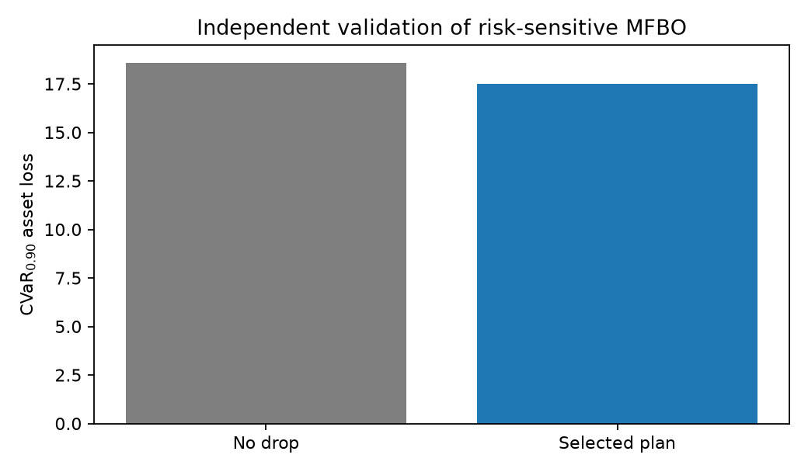
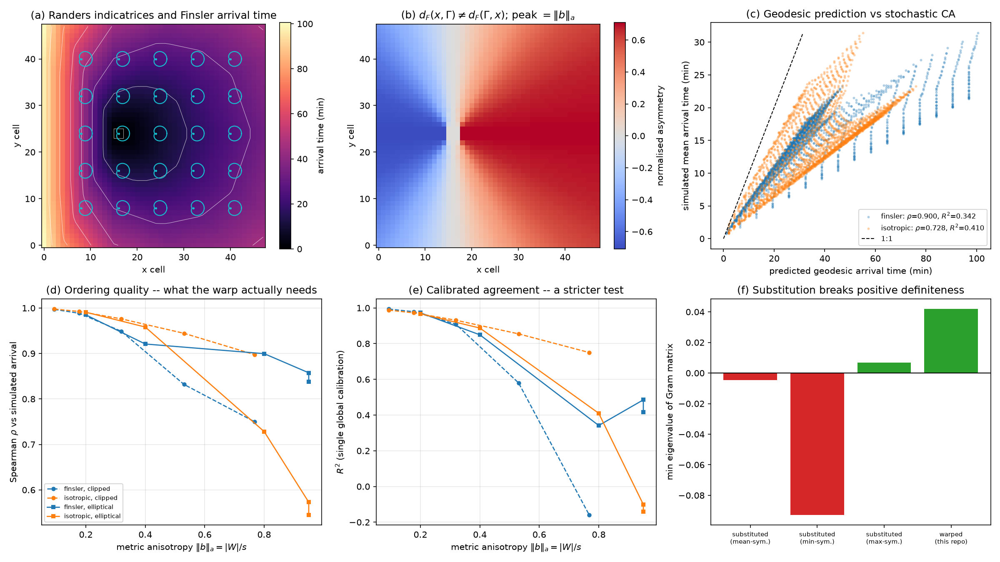

# Wildfire Drone Swarm BO

**A CVaR-targeting multi-fidelity BO planner reduced worst-tail asset loss by
5.7% against no intervention in the reproducible synthetic smoke test.**

The planner combines a stochastic cellular-automata fire simulator,
fire-front-relative interventions and an anisotropic wind-aligned Matérn
surrogate. The headline result is independently evaluated on 64 Monte-Carlo
realisations; it is a software demonstration, not a claim of operational
wildfire effectiveness.



---

## What this repo does

1. **Simulate** wildfire spread on a grid with fuel, wind, slope, and retardant decay.
2. **Parameterise** candidate drops either in Cartesian coordinates `(x, y, φ)` or in an SR fire-front frame `(s, r, δ)` between successive fire boundaries.
3. **Optimise tail risk** using empirical `CVaR_0.90` of per-realisation asset loss rather than averaging the ensemble before optimisation.
4. **Screen cheaply** with short-horizon, low-simulation rollouts before higher-fidelity evaluations in an autoregressive co-kriging BO loop.
5. **Evaluate** on synthetic stress-test scenarios and a Victoria-style semi-realistic environment.

---

## Features

| Area | Details |
|------|---------|
| Fire model | Grid CA with wind, fuel, value maps, time-varying ROS, retardant half-life |
| Drop geometry | Oriented rectangular drops with optional “avoid burning cells” |
| Coordinates | Cartesian BO and fire-front-relative `(s, r, δ)` plans |
| GP kernel | Anisotropic Matérn over positions/orientations rotated into the observed mean-wind frame |
| Fire-front geometry | Randers–Finsler metric fitted to the CA's own spread law; arrival time as a Finsler distance |
| Optimisation | CVaR objective, expected improvement, heuristic warm-starts, multi-fidelity co-kriging |
| Baselines | Ring / boundary / head–flank / value-blocking heuristics |
| Scenarios | Fuel jumps, wind corridors, asset clusters, realistic Victorian layout |

---

## Setup

Requires Python 3.11+.

```bash
git clone https://github.com/vivimartini/wildfire-drone-swarm-bo.git
cd wildfire-drone-swarm-bo

python -m venv .venv
source .venv/bin/activate          # Windows: .venv\Scripts\activate

pip install -e .
```

The editable install puts the `fire_model` package on your path so notebooks under `notebooks/` import cleanly. Each notebook also has a short bootstrap cell that locates the repo root if you open it without installing.

---

## Reproduce the headline result

```bash
bash run_all.sh
```

This creates a clean virtual environment, installs pinned dependencies, runs the
tests and reproduces `artifacts/reproduction/summary.json` plus the figure above.
The checked-in quick-run result is:

```text
No-drop CVaR_0.90:       18.5670
Selected-plan CVaR_0.90: 17.5000
Relative reduction:       5.75%
```

See [REPRODUCIBILITY.md](REPRODUCIBILITY.md) for the exact fidelity budgets,
seeds, independent validation design and full-sized command. See
[DECISIONS.md](DECISIONS.md) for modelling choices and the evidence boundary.

---

## Repository layout

```
fire_model/                      Core simulation + optimisation library
  ca.py                          Cellular automata fire model (FireEnv, FireState)
  boundary.py                    Fire-front extraction and between-boundary masks
  harmonic.py                    Harmonic strip maps → (s, r) parameterisation
  bo.py                          Bayesian optimisation in (x, y, φ)
  bo_sr.py                       CVaR, wind-aligned SR BO and multi-fidelity BO
  finsler.py                     Randers metric, Finsler arrival time, kernel warp
  finsler_validation.py          Validates the geometry against the simulator
  demo.py                        Deterministic command-line reproduction

tests/                           CA, CVaR, wind-frame and Finsler regression tests
artifacts/reproduction/          Checked-in output from the quick reproduction
artifacts/finsler/               Checked-in Finsler geometry validation

notebooks/
  experiments/                   End-to-end BO / MFBO and final experiment runs
  scenarios/                     Stress-test + realistic environment notebooks
  heuristics/                    Heuristic baselines and comparisons
  parameterization/              SR mapping checks and figure notebooks
  archive/                       Older exploratory work

figures/
  report/                        Figures used in the written report
```

---

## Notebook guide

| Goal | Notebook |
|------|----------|
| Realistic end-to-end BO | [`notebooks/experiments/end_to_end_realistic_BO.ipynb`](notebooks/experiments/end_to_end_realistic_BO.ipynb) |
| Small-grid SR BO walkthrough | [`notebooks/experiments/end_to_end_polar_BO_small.ipynb`](notebooks/experiments/end_to_end_polar_BO_small.ipynb) |
| Final experiments | [`notebooks/experiments/FINAL_EXP.ipynb`](notebooks/experiments/FINAL_EXP.ipynb) |
| Iterative / MFBO finals | [`notebooks/experiments/FINAL_EXP_ITERATIVE_MFBO.ipynb`](notebooks/experiments/FINAL_EXP_ITERATIVE_MFBO.ipynb) |
| Arrival delay vs swarm size | [`notebooks/experiments/experiment_early_detection_vs_drones.ipynb`](notebooks/experiments/experiment_early_detection_vs_drones.ipynb) |
| Scenario suite + report figures | [`notebooks/scenarios/scenarios_final_all_BO_report.ipynb`](notebooks/scenarios/scenarios_final_all_BO_report.ipynb) |
| Heuristic baselines | [`notebooks/heuristics/showcasing_heuristics.ipynb`](notebooks/heuristics/showcasing_heuristics.ipynb) |
| SR coordinate system | [`notebooks/parameterization/fire_front_sr_parameterization.ipynb`](notebooks/parameterization/fire_front_sr_parameterization.ipynb) |

---

## Method sketch

**Simulation.** Each cell burns for a finite time; spread rate depends on fuel, wind, and optional slope. Retardant deposited by drones decays over time and slows (or blocks) ignition.

**Search space.** Drops are rectangles with position and orientation. In the SR formulation, candidates live in the strip between the fire front at detection and a predicted later front, which keeps the search focused on actionable ground.

**Risk objective.** Every candidate retains its unaggregated Monte-Carlo loss
vector. BO minimises the mean of the worst 10% of losses (`CVaR_0.90`), so the
tail—not expected damage—drives plan selection.

**Wind-aligned surrogate.** Cartesian drop positions are rotated into along-wind
and cross-wind coordinates. Drop orientation is represented relative to the same
wind direction, and the Matérn kernel learns separate lengthscales on these axes.

**Finsler surrogate frame.** The wind-aligned frame above is a hand-built
approximation of a geometry the simulator already implies. `kernel_frame="finsler"`
derives it instead — see [Fire-front geometry](#fire-front-geometry-randersfinsler).

**Multi-fidelity optimisation.** An autoregressive low/high-fidelity surrogate
uses 300-second, 8-realisation rollouts to screen candidates before 600-second,
24-realisation evaluations in the reproducible run.

**Baselines.** Hand-designed heuristics (e.g. protect the head/flank, ring the fire, sit on high-value cells) provide interpretable comparisons.

---

## Fire-front geometry (Randers–Finsler)

Fire spread under wind is the canonical worked example of a **Randers metric** —
a Riemannian metric plus a one-form, where the Riemannian part is the no-wind
spread rate and the one-form is the wind drift. Richards' elliptical growth
model, the operational standard in fire modelling, is a Randers metric in
disguise, and fire arrival time is the Finslerian distance from the ignition set.

`fire_model/finsler.py` uses that directly instead of approximating it:

```python
from fire_model.finsler import randers_from_env, FinslerWarp

field = randers_from_env(env)                    # fit the metric to the CA's spread law
warp  = FinslerWarp.from_firestate(env, state)   # arrival time -> kernel-safe features
```

and the optimiser takes it as a kernel frame alongside the existing two:

```python
optimizer.run_bayes_opt(..., kernel_frame="finsler")
```

**The metric is derived, not chosen.** The CA's directional rate law is projected
onto the Randers family, so the surrogate's anisotropy follows from the spread
parameters rather than from a hand-built frame. With
`FireEnv.wind_response="elliptical"` — Richards' law, opt-in, default unchanged —
the projection is exact to machine precision: the CA's spread law *is* a Randers
indicatrix. Containment lines are then placed against where the front will be,
not against grid `x` and `y`.

**The catch, and the fix.** Finsler distance is not symmetric — travelling
upwind is slower than downwind, so `d_F(x, y) ≠ d_F(y, x)`. It therefore cannot
be substituted for the distance in a Matérn kernel: a covariance function must
be symmetric and positive definite, and a directed distance is neither.
Symmetrising it (mean or min of the two directions) restores symmetry, still
guarantees nothing about positive definiteness, and discards precisely the
asymmetry that made the geometry worth having.

So the geometry is **warped rather than substituted**. Each drop is mapped
through a fixed, deterministic function of the arrival-time field, and an
ordinary stationary Matérn acts in that warped space; positive definiteness is
then free. The asymmetry survives because the forward and reverse arrival times
enter as two separate coordinates instead of being averaged into one:

| Feature | Meaning |
|---------|---------|
| `t_forward` | `d_F(front, x)` — when the fire reaches this drop |
| `t_reverse` | `d_F(x, front)` — the asymmetry channel, discarded by symmetrising |
| `cos s`, `sin s` | which part of the perimeter the fire arrives from (periodic) |
| `cos 2δ`, `sin 2δ` | drop angle to the local front normal (π-periodic: a rectangle has no head) |

**Validation.** `python -m fire_model.finsler_validation` checks the geometry
against the simulator rather than assuming it, writing
[`artifacts/finsler/`](artifacts/finsler/):



- Geodesic arrival times track simulated first-ignition times with Spearman
  `ρ = 0.90`, against `ρ = 0.73` for an isotropic ablation that keeps the same
  mean speed and zeroes the drift. The gap widens with anisotropy — at
  `‖b‖_a = 0.95` it is `0.86` against `0.57` — and vanishes as `‖b‖_a → 0`, as it
  must.
- On the stricter test of a single global calibration constant, the isotropic
  ablation actually scores *better* (`R² = 0.41` against `0.34`), and the
  constant itself is ≈ 0.35 rather than 1. The stochastic percolation front
  outruns the mean-field rate the metric describes, by a factor that depends on
  the local hazard, so no one constant holds across a field with a wide speed
  range. Ordering is what a monotone warp coordinate actually needs; the
  calibration result is reported rather than hidden.
- Under the default clipped spread law the isotropic metric beats the Randers
  one at every wind strength tested — the clip is not an ellipse, and the fit
  says so (`residual` 3% → 20%). The geometry is only faithful where the
  simulator's own law is elliptical.
- Substituting the directed distance into a Matérn gives a non-symmetric matrix;
  the mean- and min-symmetrisations give **negative** minimum eigenvalues on
  this fire (`−4.5e−3`, `−9.3e−2`). The warp's Gram matrix is positive
  semi-definite.

**Effect on the optimiser.** Five paired BO seeds per frame, every selected
plan re-scored on 128 independent realisations (`--frames`, lower is better):

| Frame | `CVaR₀.₉₀`, elliptical | `CVaR₀.₉₀`, clipped |
|-------|-----------------------|---------------------|
| no drop | 8.36 | 10.39 |
| `wind` (default) | 6.63 ± 0.48 | 8.60 ± 0.41 |
| `finsler` | 6.77 ± 0.92 | 8.79 ± 0.20 |
| `sr` | **6.04 ± 0.66** | **8.06 ± 0.38** |

**This does not show the Finsler frame optimising better.** It is level with the
wind-aligned default (paired wins: 1 of 5 elliptical, 2 of 5 clipped) and behind
the SR frame in both spread laws. On a 32×32-cell variant of the same scenario —
identical in every other setting — the ranking against `wind` reversed
completely, 10 paired wins out of 10 for `finsler`. That reversal is itself the
finding: at five seeds these differences are scenario-dependent noise, and no
claim of an optimisation gain is supported.

A plausible reason `sr` stays ahead: its coordinates are built from *simulated*
fire boundaries, so they already encode the stochastic front's real shape,
including the percolation speedup the mean-field metric misses. What the Finsler
frame offers instead is that it is derived from the spread parameters rather
than requiring a Monte-Carlo front to exist first, that it needs no boundary
extraction or strip smoothing, and that it carries the upwind/downwind asymmetry
explicitly. See [DECISIONS.md](DECISIONS.md).

---

## Dependencies

Core dependencies are listed in `pyproject.toml`; exact reproduction versions
are pinned in `requirements-repro.txt`. Notebook-only packages are available via:

```bash
pip install -e ".[notebooks]"
```

---

## License

MIT. See [LICENSE](LICENSE).
